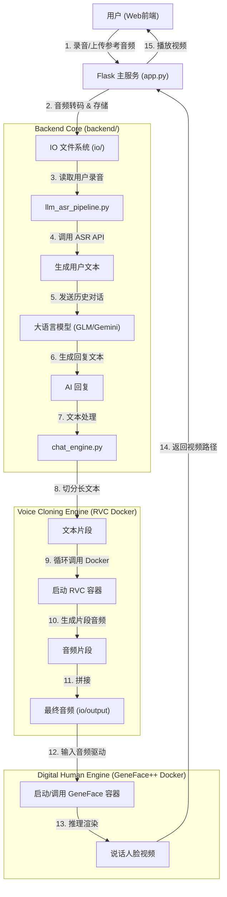

# 实时语音克隆与数字人对话系统 (Real-time Voice Cloning & Digital Human Dialogue System)

## 📖 项目简介

本项目旨在构建一个从底层模型训练到上层实时交互的全栈数字人系统。项目逻辑层层递进，分为三个核心阶段：

1.  **模型训练 (Model Training)**: 构建专属的数字人形象基座。
2.  **视频生成 (Video Generation)**: 基于音频驱动静态形象生成动态说话视频。
3.  **人机对话 (Human-Computer Interaction)**: 集成语音识别、大语言模型与语音克隆，实现与数字人的实时语音交流。


---

## 📥 资源下载与环境配置 (重要)

为了简化部署流程，我们提供了预构建的 Docker 镜像和必要的模型文件。请务必在开始前下载并按以下步骤配置。

### 1. 资源下载
* **网盘链接**: [百度网盘下载](https://pan.baidu.com/s/1tVEGLEczBMNMlN7V7iygOQ?pwd=kf5z)
* **提取码**: `kf5z`

该资源包包含以下重要文件：
* **Docker 镜像**: `rvc-app-latest.tar`, `genefacepp.tar`, `evaluate-tool.tar`
* **预训练模型**: `models_zh`, `checkpoints` 等
* **配置文件**: `.env` (包含 API Key 配置模板)

### 2. 模型文件部署
请将下载的文件夹解压，并严格按照以下路径放入项目目录中（如果文件夹不存在请手动创建）：

| 下载文件夹名 | 存放目标路径 (相对于项目根目录) | 说明 |
| :--- | :--- | :--- |
| **models_zh** | `RVC/` | RVC 语音克隆预训练模型 |
| **binary** | `GeneFace/data/` | GeneFace 基础数据 (需新建 data 文件夹) |
| **checkpoints** | `GeneFace/` | GeneFace 预训练权重 |
| **deep_3drecon** | `GeneFace/` | 3D 人脸重建模型 |
| **hubert-large-ls960-ft** | `GeneFace/data_gen/utils/process_audio/` | 音频特征提取模型 |
| **.env** | 项目根目录 (`genefaceplusplus_ui/`) | 环境变量配置文件 |

**目录结构示例：**
```text
genefaceplusplus_ui/
├── .env                 <-- 放入此处 (从网盘下载)
├── RVC/
│   └── models_zh/       <-- 放入此处
├── GeneFace/
│   ├── checkpoints/     <-- 放入此处
│   ├── deep_3drecon/    <-- 放入此处
│   ├── data/
│   │   └── binary/      <-- 放入此处
│   └── data_gen/
│       └── utils/
│           └── process_audio/
│               └── hubert-large-ls960-ft/ <-- 放入此处
```

### 3. 导入 Docker 镜像
下载资源包中的镜像文件，打开终端（Windows PowerShell 或 CMD），进入文件所在目录执行：

```bash
# 1. 导入语音克隆镜像
docker load -i rvc-app-latest.tar

# 2. 导入数字人训练/推理镜像
docker load -i genefacepp.tar

# 3. 导入评估工具镜像 (可选)
docker load -i evaluate-tool.tar
```

导入成功后，可以通过 `docker images` 命令查看已存在的镜像列表。

---

## 🚀 核心功能模块

### 第一阶段：模型训练 (Model Training)

此模块负责为数字人提供“躯体”和“形象”，完全基于 **GeneFace++** 实现。
* **自定义形象**: 支持用户上传目标人物的视频素材。
* **任务调度**: 后端 (`backend/model_trainer.py`) 集成了训练任务的参数配置（如 Epochs、GPU 选择）与状态监控逻辑。
* **核心引擎**: 使用 **GeneFace++** Docker 镜像 (`genefacepp`) 进行高保真数字人模型的训练。

### 第二阶段：视频生成 (Video Generation)

此模块负责让数字人“动起来”。
* **音频驱动**: 接收一段音频（无论是克隆生成的还是上传的），驱动训练好的数字人模型生成口型同步的说话视频。
* **推理引擎**: 基于 `backend/video_generator.py`，调用 **GeneFace++** 预训练模型进行推理渲染。

### 第三阶段：人机对话 (Human-Computer Interaction)

此模块赋予数字人“灵魂”与“声音”，实现了完整的语音交互闭环。

#### 1. 智能语音克隆 (Voice Cloning)
* **RVC (Retrieval-based Voice Conversion)**: 
    * 作为本项目的核心语音合成引擎，RVC 提供了高质量、低延迟的变声与克隆能力。
    * **运行方式**: 通过 Docker 容器化运行 (`rvc-app`)。后端会自动启动容器进行推理，确保环境一致性。
    * **处理流程**: `chat_engine` 会自动将长文本切分为短句，**循环启动 Docker 容器**分别克隆每一句话，最后将生成的音频片段**拼接**成完整的语音文件。

#### 2. 多模态大模型集成 (LLM Integration)
* **多模型支持**: 系统集成了 **ZhipuAI (GLM-4/GLM-4.5)** 和 **Google Gemini (Pro/Flash)** API。
* **智能交互**: 
    * 支持多轮对话记忆，能够联系上下文进行交流。
    * 通过精心设计的 Prompt（系统提示词），控制 AI 的回复长度与风格，使其更适合口语化表达。

#### 3. 自动化 ASR 流程 (Auto Speech Recognition)
* **全自动转录**: 用户录音上传后，后端自动调用 ASR 接口将其转录为文本。
* **智能字幕生成**: 当用户上传参考音频时，系统会自动检测是否存在对应的字幕文件；若缺失，则自动调用 ASR 生成字幕，实现了“上传即用”的便捷体验。

---

## 🏗️ 人机对话系统架构

该部分展示了用户与系统进行实时语音交互的完整数据流：



---

## 📂 目录结构与后端说明

```text
genefaceplusplus_ui/
├── app.py                  # Flask 主入口，处理 HTTP 请求与路由
├── .env                    # 环境变量配置文件 (API Keys)
├── backend/                # 核心业务逻辑模块
│   ├── chat_engine.py      # [人机对话] 主引擎。负责切分长文本、循环调用 RVC Docker 容器并拼接音频。
│   ├── llm_asr_pipeline.py # [人机对话] ASR 与 LLM 封装。负责调用智谱/Gemini API。
│   ├── model_trainer.py    # [模型训练] 负责调度 GeneFace++ 的训练任务。
│   └── video_generator.py  # [视频生成] 负责调用 GeneFace++ 进行视频生成。
│
├── geneface/               # GeneFace++ 核心代码与模型文件 (需下载模型填入)
│   ├── checkpoints/        # [下载] 预训练模型权重
│   ├── deep_3drecon/       # [下载] 3D人脸重建模型
│   ├── data/               # [下载] 二进制数据 (binary)
│   ├── data_gen/           # 数据预处理脚本
│   │   └── utils/process_audio/hubert-large-ls960-ft/ # [下载] Hubert 模型
│   └── ...
├── io/                     # 数据存储中心 (位于项目根目录)
│   ├── input/              # 存放参考音频与文本
│   ├── history/            # 对话历史与日志
│   ├── output/             # 合成结果
│   └── temp/               # 临时文件
├── RVC/                    # RVC 模型相关文件
│   ├── models_zh/          # [下载] RVC 预训练模型权重
│   ├── Dockerfile          # RVC 镜像构建文件
│   ├── RVC.py              # RVC 本地运行脚本
│   └── ...
├── static/                 # 前端资源 (JS, CSS)
└── templates/              # HTML 页面模版
```

---

## 🐳 Docker 镜像说明与运行

本项目采用双镜像架构，以隔离不同模块的复杂依赖。建议直接使用网盘中的预构建镜像。

### 镜像 1: 模型训练与视频生成 (GeneFace++)
* **镜像名称**: `genefacepp` (对应网盘中的 `genefacepp.tar`)
* **功能**: 负责数字人的训练和视频推理。
* **调用位置**: 由 `backend/model_trainer.py` 和 `backend/video_generator.py` 调用。
* **Docker构建教程位置**: `GeneFace/Docker.installation.md`
* 请参考该文档完成镜像构建。由于原项目就存在较多依赖冲突，建议直接使用预构建镜像，我们会提供网盘下载链接，也会直接放在压缩包中。

#### GeneFace++ 容器启动流程详解

项目根目录 `start_geneface.bat` （Windows）或者 `start_geneface.sh`（Linux）会执行类似以下的命令来启动容器进行训练推理，由于逻辑相同，这里仅介绍Windows系统：

```bash
docker run -d ^
    -e PYTHONUNBUFFERED=1 ^
    --name geneface ^
    -p 7869:7860 ^
    --gpus all ^
    -v "%USERPROFILE%\.cache":/root/.cache ^
    -v "%PROJECT_DIR%\GeneFace":/data/geneface ^
    --restart unless-stopped ^
    genfaceplus:0219 ^
    bash -c "source /root/miniconda3/etc/profile.d/conda.sh && conda activate pytorch && cd /data/geneface && python api_server.py"
 ```

**逻辑说明：**
1.  **数据处理**: 提供完整的视频预处理 pipeline（分辨率调整、音频特征提取、2D/3D 人脸关键点提取等），支持自定义视频数据集的快速接入与处理。
2.  **模型训练**: 分为 Head NeRF 与 Torso NeRF 两个子模型训练过程，支持通过配置文件灵活调整训练参数。
3.  **视频推理**: 提供两种推理方式：命令行批量推理与Gradio可视化界面推理，支持指定音频驱动生成视频，提供交互式操作体验，方便快速测试。

### 镜像 2: 语音克隆 (RVC)
* **镜像名称**: `rvc-app` (对应网盘中的 `rvc-app-latest.tar`)
* **功能**: 负责 RVC 语音克隆推理。
* **Dockerfile 位置**: `RVC/Dockerfile`
* **构建命令**:
  请进入 `RVC` 目录执行构建：
  ```bash
  cd RVC
  docker build -t rvc-app .
  ```

#### RVC 容器启动流程详解
后端 `chat_engine.py` 会自动执行类似以下的命令来启动一次性容器进行推理。对于长文本，此过程会**循环执行**多次：

```bash
docker run --rm --gpus all \
  -v ./io:/io \
  -v ./RVC/models_zh:/app/models_zh \
  rvc-app \
  --ref /io/input/audio/ref_audio.wav \
  --text-file /io/temp/chunk_0.txt \
  --out /io/temp/chunk_0.wav
```

**逻辑说明：**
1.  **切分**: 将 LLM 返回的长文本按标点切分为多个短句。
2.  **循环**: 针对每个短句，启动一个新的 `rvc-app` 容器进行推理。
3.  **拼接**: 所有容器运行完毕后，使用 `pydub` 将生成的音频片段拼接成完整的输出文件。

---

## 🚀 快速启动指南

### 1. 环境准备
确保本地安装了 **Python 3.9+** (Conda)、**CUDA** 和 **FFmpeg**。同时确保 **Docker** 已安装并支持 NVIDIA GPU (`nvidia-container-toolkit`)。

```bash
# Ubuntu/Debian 安装系统依赖
sudo apt-get update && sudo apt-get install -y ffmpeg libsndfile1
```

### 2. 安装依赖

```bash
# 创建环境
conda create -n voice_chat python=3.9
conda activate voice_chat

# 安装核心依赖
pip install flask pydub requests python-dotenv zhipuai werkzeug sniffio
```

### 3. 配置与启动

1.  **配置 API Key**: 在 `.env` 文件中填入智谱或 Gemini 的 Key。
2.  **准备模型**: 
    * 从网盘下载资料包，解压后将 `models_zh` 文件夹内的内容放入项目目录下的 `RVC/models_zh/` 中。
3.  **导入镜像**: 参考前文“Docker 镜像导入”章节，导入 `rvc-app-latest.tar` 和 `genefacepp.tar`。
4.  **启动服务**:
    在项目根目录下，执行命令：
    ```bash
    # 如需使用数字人功能，请先启动 GeneFace 服务 (具体脚本请参考团队说明)
    # 启动主服务
    python app.py
    ```
    * 服务端口: **5000**
    * 访问地址: `http://127.0.0.1:5000` (或服务器 IP)

---

## 🧪 探索与实验

### 关于 CosyVoice
我们在开发过程中尝试引入了 **CosyVoice** (阿里的零样本语音克隆模型) 作为第二种克隆方案。
* **现状**: 代码库中保留了 CosyVoice 的相关接口与逻辑。
* **说明**: 鉴于 CosyVoice 目前对计算资源要求较高且在部分环境下推理速度不如预期，本项目目前的生产环境默认使用 **RVC** 进行极其稳定的实时克隆。CosyVoice 作为一个实验性功能保留，供后续研究使用。
