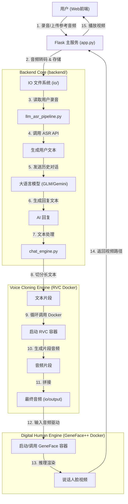

# 实时语音克隆与数字人对话系统 (Real-time Voice Cloning & Digital Human Dialogue System)

## 📖 项目简介

本项目旨在构建一个从底层模型训练到上层实时交互的全栈数字人系统。项目逻辑层层递进，分为三个核心阶段：

1.  **模型训练 (Model Training)**: 构建专属的数字人形象基座。
2.  **视频生成 (Video Generation)**: 基于音频驱动静态形象生成动态说话视频。
3.  **人机对话 (Human-Computer Interaction)**: 集成语音识别、大语言模型与语音克隆，实现与数字人的实时语音交流。


---
## 📥 资源下载与环境配置 (重要)

为了简化部署流程，我们提供了预构建的 Docker 镜像和必要的模型文件。请务必在开始前下载并按以下步骤配置。

### 1. 资源下载
* **网盘链接**: [百度网盘下载](https://pan.baidu.com/s/1tVEGLEczBMNMlN7V7iygOQ?pwd=kf5z)
* **提取码**: `kf5z`

该资源包包含以下重要文件：
* **Docker 镜像**: `rvc-app-latest.tar`, `genefacepp.tar`, `evaluate-tool.tar`
* **预训练模型**: `models_zh`, `checkpoints` 等
* **配置文件**: `.env` (包含 API Key 配置模板)

### 2. 模型文件部署
请将下载的文件夹解压，并严格按照以下路径放入项目目录中（如果文件夹不存在请手动创建）：

| 下载文件夹名 | 存放目标路径 (相对于项目根目录) | 说明 |
| :--- | :--- | :--- |
| **models_zh** | `RVC/` | RVC 语音克隆预训练模型 |
| **binary** | `GeneFace/data/` | GeneFace 基础数据 (需新建 data 文件夹) |
| **checkpoints** | `GeneFace/` | GeneFace 预训练权重 |
| **deep_3drecon** | `GeneFace/` | 3D 人脸重建模型 |
| **hubert-large-ls960-ft** | `GeneFace/data_gen/utils/process_audio/` | 音频特征提取模型 |
| **.env** | 项目根目录 (`genefaceplusplus_ui/`) | 环境变量配置文件 |

**目录结构示例：**
```text
genefaceplusplus_ui/
├── .env                 <-- 放入此处 (从网盘下载)
├── RVC/
│   └── models_zh/       <-- 放入此处
├── GeneFace/
│   ├── checkpoints/     <-- 放入此处
│   ├── deep_3drecon/    <-- 放入此处
│   ├── data/
│   │   └── binary/      <-- 放入此处
│   └── data_gen/
│       └── utils/
│           └── process_audio/
│               └── hubert-large-ls960-ft/ <-- 放入此处
```

### 3. 导入 Docker 镜像
下载资源包中的镜像文件，打开终端（Windows PowerShell 或 CMD），进入文件所在目录执行：

```bash
# 1. 导入语音克隆镜像
docker load -i rvc-app-latest.tar

# 2. 导入数字人训练/推理镜像
docker load -i genefacepp.tar

# 3. 导入评估工具镜像 (可选)
docker load -i evaluate-tool.tar
```

导入成功后，可以通过 `docker images` 命令查看已存在的镜像列表。

---

## 🚀 核心功能模块

### 第一阶段：模型训练 (Model Training)

此模块负责为数字人提供“躯体”和“形象”，完全基于 **GeneFace++** 实现。
* **自定义形象**: 支持用户上传目标人物的视频素材。
* **任务调度**: 后端 (`backend/model_trainer.py`) 集成了训练任务的参数配置（如 max_steps、GPU 选择）与状态监控逻辑。
* **核心引擎**: 使用 **GeneFace++** Docker 镜像进行高保真数字人模型的训练。

### 第二阶段：视频生成 (Video Generation)

此模块负责让数字人“动起来”。
* **音频驱动**: 接收一段音频（无论是克隆生成的还是上传的），驱动训练好的数字人模型生成口型同步的说话视频。
* **推理引擎**: 基于 `backend/video_generator.py`，调用 **GeneFace++** 预训练模型进行推理渲染。

### 第三阶段：人机对话 (Human-Computer Interaction)

此模块赋予数字人“灵魂”与“声音”，实现了完整的语音交互闭环。

#### 1. 智能语音克隆 (Voice Cloning)
* **RVC (Retrieval-based Voice Conversion)**: 
    * 作为本项目的核心语音合成引擎，RVC 提供了高质量、低延迟的变声与克隆能力。
    * **运行方式**: 通过 Docker 容器化运行。后端会自动启动容器进行推理，确保环境一致性。
    * **处理流程**: `chat_engine` 会自动将长文本切分为短句，**循环启动 Docker 容器**分别克隆每一句话，最后将生成的音频片段**拼接**成完整的语音文件。

#### 2. 多模态大模型集成 (LLM Integration)
* **多模型支持**: 系统集成了 **ZhipuAI (GLM-4/GLM-4.5)** 和 **Google Gemini (Pro/Flash)** API。
* **智能交互**: 
    * 支持多轮对话记忆，能够联系上下文进行交流。
    * 通过精心设计的 Prompt（系统提示词），控制 AI 的回复长度与风格，使其更适合口语化表达。

#### 3. 自动化 ASR 流程 (Auto Speech Recognition)
* **全自动转录**: 用户录音上传后，后端自动调用 ASR 接口将其转录为文本。
* **智能字幕生成**: 当用户上传参考音频时，系统会自动检测是否存在对应的字幕文件；若缺失，则自动调用 ASR 生成字幕，实现了“上传即用”的便捷体验。

---

## 🏗️ 人机对话系统架构

该部分展示了用户与系统进行实时语音交互的完整数据流：



---

## 📂 目录结构与后端说明

```text
genefaceplusplus_ui/
├── app.py                  # Flask 主入口，处理 HTTP 请求与路由
├── .env                    # 环境变量配置文件 (API Keys)
├── backend/                # 核心业务逻辑模块
│   ├── chat_engine.py      # [人机对话] 主引擎。负责切分长文本、循环调用 RVC Docker 容器并拼接音频。
│   ├── llm_asr_pipeline.py # [人机对话] ASR 与 LLM 封装。负责调用智谱/Gemini API。
│   ├── model_trainer.py    # [模型训练] 负责调度 GeneFace++ 的训练任务。
│   └── video_generator.py  # [视频生成] 负责调用 GeneFace++ 进行视频生成。
│
├── geneface/               # GeneFace++ 核心代码与模型文件
│   ├── data_gen/
│   │   ├── utils/                  # 工具函数与核心功能模块目录，提供各类数据处理的基础能力
│   │   │   ├── mp_feature_extractors/  # 基于MediaPipe的特征提取相关模块
│   │   │   │   └── mp_segmenter.py    # 实现背景提取功能，通过处理图像列表和分割掩码列表，利用最近邻算法生成背景图像
│   │   │   ├── process_video/          # 视频处理相关工具函数集合
│   │   │   │   ├── fit_3dmm_landmark.py  # 提供加载文件的功能，用于读取3DMM landmarks等序列化数据
│   │   │   │   ├── euler2quaterion.py    # 实现欧拉角与四元数、旋转矩阵之间的转换，用于姿态相关计算
│   │   │   │   ├── extract_segment_imgs.py  # 负责视频帧分割提取，包括单/多进程处理、分割掩码生成、背景提取及合成图像生成
│   │   │   │   ├── extract_lm2d.py       # 检查2D landmarks输出文件是否存在，用于过滤已处理视频
│   │   │   │   ├── resample_video_to_25fps_resize_to_512.py  # 获取视频基本信息（高度、宽度、帧率、总帧数），为视频重采样和尺寸调整提供基础数据
│   │   │   │   └── extract_blink.py      # 实现基于多边形面积计算的眨眼检测，通过处理眼部关键点坐标计算面积变化
│   │   │   └── process_audio/               # 音频处理核心模块
│   │   │       ├── extract_hubert.py        # 提取HuBERT特征
│   │   │       ├── resample_audio_to_16k.py # 将音频重采样为16kHz
│   │   │       └── extract_mel_f0.py        # 提取梅尔频谱(mel)和基频(F0)
│   │   │
│   │   ├── eg3d/                   # 与EG3D相关的模块目录，包含模型封装、推理等功能
│   │   │  └── convert_to_eg3d_convention.py  # 转换为eg3d格式
│   │   └── runs/                   # 运行脚本与流程指导目录，用于工程化执行数据处理流程
│   │      ├── nerf/                 # 与NeRF（神经辐射场）相关的运行配置与指导
│   │      │   └── process_guide.md  # 提供NeRF数据处理流程指导，包括具体步骤（如Step4的二值化）和命令示例
│   │      └── binarizer_nerf.py     # 二值化处理脚本（根据process_guide.md推断），用于生成NeRF所需的二进制数据集
│   │
│   ├── data_util/                  # 数据处理工具模块
│   │   └── face3d_helper.py        # 3D人脸相关处理工具类。基于BFM模型实现3D人脸网格、关键点的重建与处理
│   │
│   ├── deep_3drecon/                  # 3D人脸重建相关核心模块目录
│   │   ├── util/                      # 工具函数与渲染相关模块
│   │   │   └── mesh_renderer.py       # 实现可微分的网格渲染器，基于pytorch3d，用于渲染网格的掩码、深度和特征图
│   │   ├── deep_3drecon_models/       # 3D人脸模型相关模块
│   │   │   └── bfm.py                 # 定义参数化3D人脸模型(BFM)，包含形状、纹理计算，姿态变换，光照计算等功能
│   │   ├── BFM/ 
│   │   └── secc_renderer.py           # 基于3D人脸模型和网格渲染器实现SECC渲染，处理输入参数生成人脸掩码和SECC特征图
│   ├── inference/                      # 推理相关功能模块目录
│   │   ├── infer_utils.py                 # 提供获取基频(f0)的工具函数，通过处理音频文件提取音频波、梅尔频谱并计算f0相关数据
│   │   ├── app_genefacepp.py              # 构建GeneFace++的Gradio交互界面，定义输入输出组件、参数设置及生成按钮的回调逻辑，用于用户交互生成3D说话人脸视频
│   │   └── genefacepp_infer.py            # 实现音频到面部运动的前向计算，处理特征提取、投影、归一化等，为3D人脸生成提供关键的面部运动参数
│   ├── egs/                                   # 实验配置文件根目录，包含不同数据集和任务的配置
│   │   ├── datasets/                          # 各数据集相关配置目录
│   │   └── egs_bases/                         # 基础配置模板目录
│   │       └── radnerf/                       # RADNeRF相关基础配置
│   │           ├── base.yaml                  # 核心基础配置，含数据集路径、训练参数、NeRF参数等通用设置
│   │           ├── lm3d_radnerf.yaml          # 基于LM3D的RADNeRF基础配置，指定条件类型、窗口大小等
│   │           └── radnerf.yaml               # 通用RADNeRF基础配置，定义任务类和条件参数等
│   ├── data/                                  # 数据存储目录
│   │   ├── raw/                               # 原始数据目录
│   │   │   └── videos/                        # 原始视频文件存储，按video_id命名
│   │   ├── processed/                         # 处理后的数据目录
│   │   │   └── videos/                        # 处理后的视频相关数据
│   │   └── binary/                            # 二进制数据目录
│   │       └── videos/                        # 二进制格式的视频数据，用于高效加载
│   ├── checkpoints/                           # 模型 checkpoint 存储目录
│   │   └── motion2video_nerf/                 # 运动转视频相关模型 checkpoint
│   ├── tasks/                          # 任务相关模块目录，包含不同任务的实现
│   │   ├── radnerfs/                   # RADNeRF相关任务模块目录
│   │   │   ├── radnerf.py                  # 基础RADNeRF模型任务实现，包含模型构建、训练/推理流程、损失计算等核心逻辑，处理单帧渲染与训练步骤
│   │   │   ├── radnerf_sr.py               # 带超分辨率(SR)功能的RADNeRF任务实现，继承基础任务，扩展了超分辨率相关的损失计算和推理逻辑，支持高分辨率图像生成
│   │   │   ├── radnerf_torso.py            # 针对躯干部分的RADNeRF任务实现，加载头部模型权重并专注于躯干部分训练，定义了躯干相关损失和优化器配置
│   │   │   ├── radnerf_torso_sr.py         # 带超分辨率功能的躯干RADNeRF任务，结合躯干训练和超分辨率，计算躯干超分损失，扩展了躯干高分辨率生成能力
│   │   │   ├── dataset_utils.py            # 数据集工具函数，包含相机路径平滑、坐标网格生成等，用于数据预处理和相机参数处理
│   │   │   └── losses.py                   # 损失函数定义，包含感知损失、GAN损失、L1损失等，为模型训练提供多种损失计算方式
│   │   └── run.py                      # 任务运行入口，负责根据配置导入并启动相应的任务类
│   ├── modules/                      # 核心功能模块目录，包含多个子模块
│   │   ├── eg3ds/                    # EG3DS相关模型与工具模块
│   │   │   ├── models/               # EG3DS模型定义目录
│   │   │   │   ├── networks_stylegan3.py  # 定义StyleGAN3相关网络组件，包含额外的repr方法
│   │   │   │   ├── networks_stylegan2.py  # 实现StyleGAN2网络架构，包含卷积、全连接层等基础组件及映射网络
│   │   │   │   └── dual_discriminator_cond.py  # 定义条件双判别器，处理输入图像和条件信息
│   │   │   ├── torch_utils/          # EG3DS用到的PyTorch工具
│   │   │   │   └── ops/              # 操作相关工具
│   │   │   │       └── conv2d_resample.py  # 实现带上下采样的2D卷积操作，支持多种采样和填充模式
│   │   │   └── camera_utils/         # 相机相关工具
│   │   │       └── pose_sampler.py   # 实现相机姿态采样，生成相机到世界的变换矩阵
│   │   ├── radnerfs/                  # 辐射场（NeRF相关）核心模块目录
│   │   │   ├── raymarching/           # 光线步进相关模块
│   │   │   │   └── raymarching.py     # 实现光线步进训练函数，包含前向传播生成采样点等信息，以及反向传播计算光线原点和方向的梯度，用于辐射场的体积采样与优化
│   │   │   ├── encoders/              # 编码器相关模块
│   │   │   │   ├── shencoder/         # 球谐函数编码器相关
│   │   │   │   │   ├── backend.py     # 球谐编码器的CUDA后端实现，负责加载编译相关C++/CUDA代码
│   │   │   │   │   └── sphere_harmonics.py  # 实现球谐函数编码前向传播，将输入坐标编码为高维特征，支持梯度计算
│   │   │   │   ├── gridencoder/       # 网格编码器相关
│   │   │   │   │   └── grid.py        # 实现网格编码的总变差梯度计算，用于优化网格嵌入参数，提升编码稳定性
│   │   │   │   └── freqencoder/       # 频率编码器相关
│   │   │   │       ├── freq.py        # 定义FreqEncoder类，实现频率编码功能（未直接展示代码，通过__init__.py导入）
│   │   │   │       └── __init__.py    # 导入频率编码器模块，暴露FreqEncoder类
│   │   │   ├── renderer.py            # 渲染器相关，包含更新密度网格和密度位场的功能，通过随机条件特征采样点计算密度，使用指数移动平均更新网格，提升辐射场渲染性能
│   │   │   ├── cond_encoder.py        # 条件编码器，定义AudioNet类，通过卷积和全连接层提取音频特征，将输入的音频特征编码为适合辐射场的条件特征
│   │   │   ├── radnerf.py             # 辐射场核心模块，定义cal_cond_feat方法，处理不同类型的条件输入，生成条件特征，支持添加眨眼特征和注意力机制处理
│   │   │   ├── radnerf_torso_sr.py    # 与躯干相关的辐射场模块，实现躯干密度网格的更新，通过随机姿态和个体编码采样点计算躯干密度，使用最大池化进行网格膨胀更新
│   │   │   └── utils.py               # 工具函数模块，包含matrix_to_euler_angles函数，实现旋转矩阵到欧拉角的转换，用于处理姿态相关计算
│   │   ├── audio2motion/             # 音频到动作转换相关模型
│   │   │   ├── cnn_models.py         # 定义基于CNN的音频到动作转换模型，包含残差块、卷积块等
│   │   │   └── transformer_models.py # 实现基于Transformer的模型，包含FFT块等组件
│   │   ├── postnet/                  # 特征投影
│   │   │   └── lle.py               # 将输入特征通过其近邻特征的线性组合来表示，核心作用是在保持局部结构的前提下进行特征转换
│   │   └── commons/                       # 公共组件与工具函数目录，包含多个模块共用的功能实现
│   │       ├── improved_diffusion/        # 改进扩散模型相关实现
│   │       │   ├── image_datasets.py      # 递归生成图像文件列表，用于加载图像数据集
│   │       │   ├── gaussian_diffusion.py  # 实现高斯扩散过程核心逻辑，包括beta调度、前后验分布计算等
│   │       │   ├── respace.py            # 处理扩散时间步的缩放转换
│   │       │   ├── losses.py              # 提供扩散模型相关损失函数，如离散高斯对数似然计算
│   │       │   ├── fp16_util.py           # 提供FP16精度转换工具，支持模块在float32和float16间转换
│   │       │   ├── logger.py              # 日志通信设置工具
│   │       │   └── train_util.py          # 扩散模型训练过程中的日志记录工具，用于记录损失相关量化指标
│   │       ├── conformer/                 # Conformer模型相关组件
│   │       │   ├── conformer.py           # 实现Conformer层，包含注意力机制和卷积模块
│   │       │   └── espnet_transformer_attn.py  # 实现Transformer注意力机制，支持Flash注意力加速
│   │       ├── rel_transformer.py         # 实现带相对位置编码的Transformer模型，包含编码器和多头注意力
│   │       ├── conv.py                    # 定义卷积层相关模块，支持条件输入和多种归一化方式
│   │       ├── normalizing_flow/          # 归一化流相关模块
│   │       │   └── glow_modules.py        # 实现Glow模型中的模块，包含逆变换权重存储
│   │       ├── unet1d.py                  # 定义1D U-Net的基础块，包含卷积和归一化层
│   │       ├── vqvae_lfq_y.py             # 实现Lookup Free Quantization（LFQ）的变体，基于二进制量化
│   │       ├── vqvae_fsq.py               # 实现有限标量量化（FSQ）的码本查询功能
│   │       ├── taming_tfm_modules.py      # 提供Taming Transformer中的归一化模块
│   │       ├── transformer.py             # 实现Transformer基础层，包含多头注意力和前馈网络
│   │       ├── vqvae_lfq.py               # 实现Lookup Free Quantization（LFQ）核心逻辑，支持多码本量化
│   │       ├── vqvae_taming.py            # 实现基于Taming框架的VQ-VAE模型，包含码本更新和量化逻辑
│   │       ├── loralib/                   # LoRA（Low-Rank Adaptation）相关实现
│   │       │   ├── __init__.py            # 导出LoRA层和工具函数
│   │       │   ├── layers.py              # 定义LoRA相关层
│   │       │   └── utils.py               # LoRA相关工具函数
│   │       ├── layers.py                  # 提供基础层实现，如支持指定维度的LayerNorm
│   │       └── gpt.py                     # 实现GPT模型层，包含注意力和前馈网络块
│   └── utils/                          # 通用工具与公共模块目录
│       ├── commons/                       # 通用工具与核心组件目录，包含各模块共享的功能实现
│       │   ├── hparams.py                 # 处理配置参数，支持从配置文件、命令行参数加载和更新超参数，管理实验配置的保存与加载
│       │   ├── indexed_datasets.py        # 实现带索引的数据集读取功能，支持分块数据读取和高效索引访问，通过字节偏移字节偏移量定位数据块
│       │   ├── trainer.py                 # 训练器核心模块，封装模型训练、验证、测试流程，支持分布式训练(DDP)、混合精度训练(AMP)、 checkpoint管理等
│       │   ├── multiprocess_utils.py      # 多进程任务处理工具，提供并行执行任务的功能，支持有序/无序结果返回和上下文初始化
│       │   ├── base_task.py               # 定义基础任务类，规范训练步骤接口，包含训练损失计算、日志记录等通用逻辑
│       │   ├── ddp_utils.py               # 分布式分布式训练(DDPS)相关工具，重写DDP的forward方法以适配训练/验证/测试步骤的张量同步逻辑
│       │   ├── dataset_utils.py           # 数据集处理工具，提供2D张量的填充拼接功能，将列表形式的2D张量转换为统一形状的3D张量
│       │   └── crop_head.py               # 提供人脸人脸裁剪相关的仿射变换矩阵计算，用于将人脸特征点对齐到目标区域
│       ├── audio/                          # 音频处理相关核心模块目录
│       │   ├── __init__.py                 # 包含 librosa_wav2spec 函数，实现从音频波形提取梅尔频谱和线性频谱等功能
│       │   ├── pitch/                      # 音高提取相关模块
│       │   │   ├── crepe_utils.py          # 提供基于CREPE模型的音高预测及校正功能，包括多种音高转换、能量校正等函数
│       │   │   ├── extractor_utils.py      # 包含音高提取辅助函数，如基于谐波能量寻找最佳基频等功能
│       │   │   ├── utils.py                # 提供音高反归一化功能，处理不同归一化方式的音高数据
│       │   │   └── uv_utils.py             # 包含寻找最近STFT频带的函数，辅助音高相关处理
│       │   ├── pitch_extractors.py         # 注册并实现多种音高提取器（如harvest、dio、parselmouth、reaper等），提供统一的音高提取接口
│       │   ├── vad.py                      # 实现基于WebRTC VAD的语音活动检测，用于修剪音频中的长静音片段
│       │   ├── io.py                       # 提供音频保存功能，支持WAV格式保存及MP3格式转换，包含响度归一化处理
│       │   └── dct.py                      # 实现离散余弦变换（DCT）功能，基于PyTorch操作，支持正交归一化
│       ├── nn/                         # 神经网络相关工具
│       │   ├── seq_utils.py            # 序列相关操作，`select_attn`方法用于处理注意力权重（如选择最佳层/头的注意力或计算平均注意力）
│       │   └── schedulers.py           # 学习率调度器，实现带预热和指数衰减的学习率更新策略
│       ├── visualization/                  # 可视化相关模块目录
│       │   ├── plot_spec.py                # 提供频谱图可视化功能，支持添加基频(f0)曲线、时长标记(gt/pred)等信息，生成带标注的频谱图matplotlib图表
│       │   ├── ffmpeg_utils.py             # 提供将图片序列转换为视频的功能，支持添加音频，基于ffmpeg实现
│       │   ├── lm_visualizer.py            # 实现3D landmarks序列到视频的可视化，可读取npy文件中的关键点数据，生成带关键点标记的视频并支持添加音频
│       │   └── draw_3d_landmark.py         # 实现3D landmarks可视化交互界面，基于DearPyGui构建，支持相机旋转、缩放、平移操作，可编辑3D关键点位置并保存渲染结果
│       └── useful_cmd_lines/                  # 可视化相关模块目录
│           └── clean_gpu.py                # 提供频谱图可视化功能，支持添加基频(f0)曲线、时长标记(gt/pred)等信息，生成带标注的频谱图matplotlib图表
│   
├── io/                     # 数据存储中心 (位于项目根目录)
│   ├── input/              # 存放参考音频与文本
│   │   ├── audio/          # 参考音频 (.wav)
│   │   └── text/           # 参考文本 (.txt)
│   ├── history/            # 对话历史与日志
│   ├── output/             # 合成结果
│   └── temp/               # 临时文件
├── RVC/                    # RVC 模型相关文件
│   ├── models_zh/          # RVC 预训练模型权重 (需下载)
│   ├── Dockerfile          # RVC 镜像构建文件
│   └── ...
├── static/                 # 前端资源 (JS, CSS)
└── templates/              # HTML 页面模版
```

---

## 🐳 Docker 镜像说明与运行

本项目采用双镜像架构，以隔离不同模块的复杂依赖。

### 镜像 1: 模型训练与视频生成 (GeneFace++)

* **镜像名称**: `genefaceplus:0219`
* **功能**: 负责 GeneFace++ 视频模型训练推理。
* **Docker构建教程位置**: `GeneFace/Docker.installation.md`
* 请参考该文档完成镜像构建。由于原项目就存在较多依赖冲突，建议直接使用预构建镜像，我们会提供网盘下载链接，也会直接放在压缩包中。

#### GeneFace++ 容器启动流程详解

项目根目录 `start_geneface.bat` （Windows）或者 `start_geneface.sh`（Linux）会执行类似以下的命令来启动容器进行训练推理，由于逻辑相同，这里仅介绍Windows系统：

```bash
docker run -d ^
    -e PYTHONUNBUFFERED=1 ^
    --name geneface ^
    -p 7869:7860 ^
    --gpus all ^
    -v "%USERPROFILE%\.cache":/root/.cache ^
    -v "%PROJECT_DIR%\GeneFace":/data/geneface ^
    --restart unless-stopped ^
    genfaceplus:0219 ^
    bash -c "source /root/miniconda3/etc/profile.d/conda.sh && conda activate pytorch && cd /data/geneface && python api_server.py"
 ```

**逻辑说明：**
1.  **数据处理**: 提供完整的视频预处理 pipeline（分辨率调整、音频特征提取、2D/3D 人脸关键点提取等），支持自定义视频数据集的快速接入与处理。
2.  **模型训练**: 分为 Head NeRF 与 Torso NeRF 两个子模型训练过程，支持通过配置文件灵活调整训练参数。
3.  **视频推理**: 提供两种推理方式：命令行批量推理与Gradio可视化界面推理，支持指定音频驱动生成视频，提供交互式操作体验，方便快速测试。


### 镜像 2: 语音克隆 (RVC)
* **镜像名称**: `rvc-app`
* **功能**: 负责 RVC 语音克隆推理。
* **Dockerfile 位置**: `RVC/Dockerfile`
* **构建命令**:
  请进入 `RVC` 目录执行构建：
  ```bash
  cd RVC
  docker build -t rvc-app .
  ```

#### RVC 容器启动流程详解
后端 `chat_engine.py` 会自动执行类似以下的命令来启动一次性容器进行推理。对于长文本，此过程会**循环执行**多次：

```bash
docker run --rm --gpus all \
  -v ./io:/io \
  -v ./RVC/models_zh:/app/models_zh \
  rvc-app \
  --ref /io/input/audio/ref_audio.wav \
  --text-file /io/temp/chunk_0.txt \
  --out /io/temp/chunk_0.wav
```

**逻辑说明：**
1.  **切分**: 将 LLM 返回的长文本按标点切分为多个短句。
2.  **循环**: 针对每个短句，启动一个新的 `rvc-app` 容器进行推理。
3.  **拼接**: 所有容器运行完毕后，使用 `pydub` 将生成的音频片段拼接成完整的输出文件。

---

## 🚀 快速启动指南

### 1. 环境准备
确保本地安装了 **Python 3.9+** (Conda)、**CUDA** 和 **FFmpeg**。同时确保 **Docker** 已安装并支持 NVIDIA GPU (`nvidia-container-toolkit`)。

```bash
# Ubuntu/Debian 安装系统依赖
sudo apt-get update && sudo apt-get install -y ffmpeg libsndfile1
```

### 2. 安装依赖

```bash
# 创建环境
conda create -n voice_chat python=3.9
conda activate voice_chat

# 安装核心依赖
pip install flask pydub requests python-dotenv zhipuai werkzeug
```

### 3. 配置与启动

1.  **配置 API Key**: 在 `.env` 文件中填入智谱或 Gemini 的 Key。
2.  **准备模型**: 
    * 需要将 RVC 预训练模型放入 `RVC/models_zh/` 目录下。
    * **模型下载链接**: [百度网盘](https://pan.baidu.com/s/1kEEMK-O1bfIRVgjLWC_Z9Q?pwd=cegc) (提取码: `cegc`)
    * 下载 `models_zh.zip` 后，请解压并将内容覆盖至 `RVC/models_zh/` 文件夹。
3.  **启动服务**:
    在项目根目录下，执行命令：
    ```bash
    .\start_geneface.bat
    python app.py
    ```
    * 服务端口: **5000**
    * 访问地址: `http://127.0.0.1:5000` (或服务器 IP)

---

## 🧪 探索与实验

### 关于 CosyVoice
我们在开发过程中尝试引入了 **CosyVoice** (阿里的零样本语音克隆模型) 作为第二种克隆方案。
* **现状**: 代码库中保留了 CosyVoice 的相关接口与逻辑。
* **说明**: 鉴于 CosyVoice 目前对计算资源要求较高且在部分环境下推理速度不如预期，本项目目前的生产环境默认使用 **RVC** 进行极其稳定的实时克隆。CosyVoice 作为一个实验性功能保留，供后续研究使用。

---